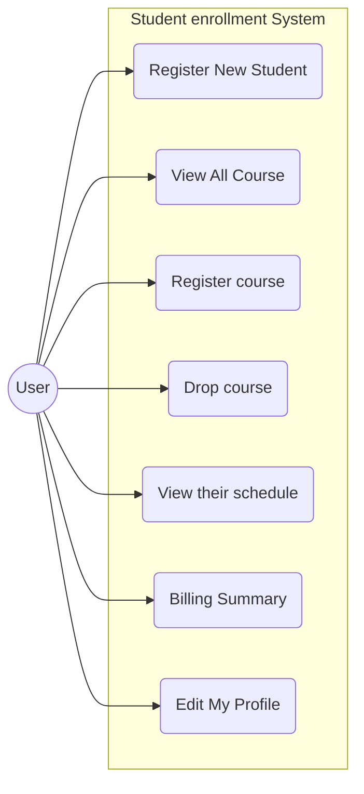
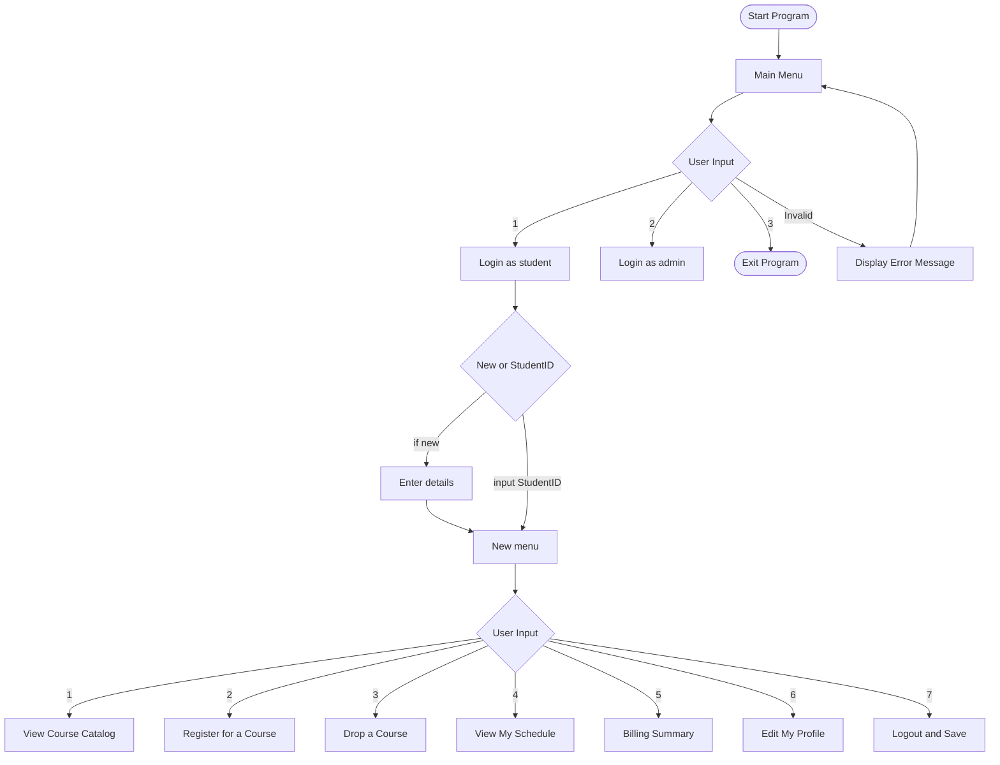

# unknownapp
This is an unknown application written in Java

### Use Case Diagram

```mermaid
graph LR
    User((User))
    
    subgraph "Student enrollment System"
        UC1(Register New Student)
        UC2(View All Course)
        UC3(Register course)
        UC4(Drop course)
        UC5(View their schedule)
        UC6(Billing Summary)
        UC7(Edit My Profile)

    end

    User --> UC1
    User --> UC2
    User --> UC3
    User --> UC4
    User --> UC5
    User --> UC6
    User --> UC7
```
### Flowchart of the main workflow

```mermaid
    flowchart TD
        A([Start Program]) --> B[Main Menu]
        B --> C{User Input}
        
        C -- "1" --> D[Login as student]
        D --> E{New or StudentID}
        E -- "if new" --> A1[Enter details] --> A2
        E -- "input StudentID" --> A2[New menu]
        A2 --> A3{User Input}
        A3 -- "1" --> A4[View Course Catalog]
        A3 -- "2" --> A5[Register for a Course]
        A3 -- "3" --> A6[Drop a Course]
        A3 -- "4" --> A7[View My Schedule]
        A3 -- "5" --> A8[Billing Summary]
        A3 -- "6" --> A9[Edit My Profile]
        A3 -- "7" --> A10[Logout and Save]
        
        C -- "2" --> F[Login as admin]
        C -- "3" --> L([Exit Program])
        
        C -- "Invalid" --> M[Display Error Message]
        M --> B
```
### Prompts
